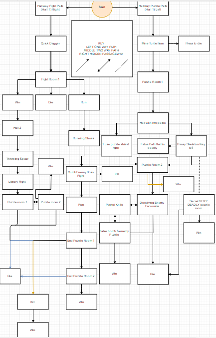

# finalProject
For this project we made a text based adventure game for our Java Programming class.
We like to call it Dungeon Escape, in it the player is given various choices to make throughout the game.
There are multiple endings and ways to fail. There are items that do different things when you pick them up and the goal is to survive long enough to make it to the end.
We had a few obstacles that we had to overcome, one of which was we had issues getting a loop to stop. Another issue we had to overcome was time and we came in after school and worked on our project and even a little bit at home.

<a href="https://youtu.be/k7WCmrmI6tw">My video is here</a>
